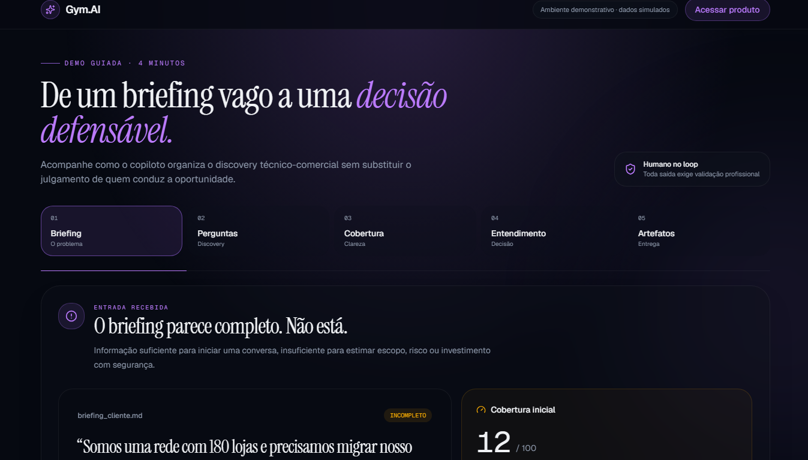
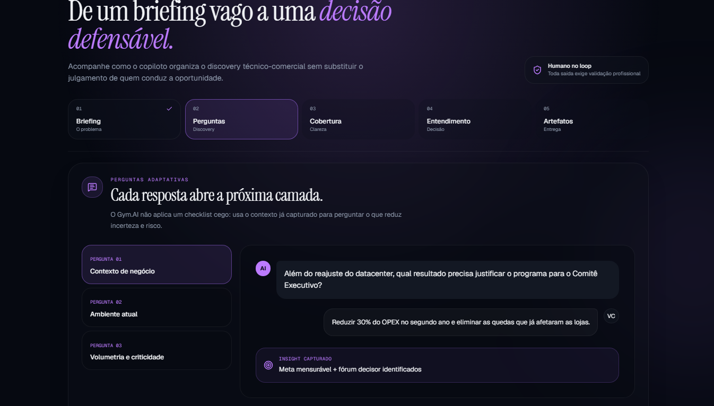
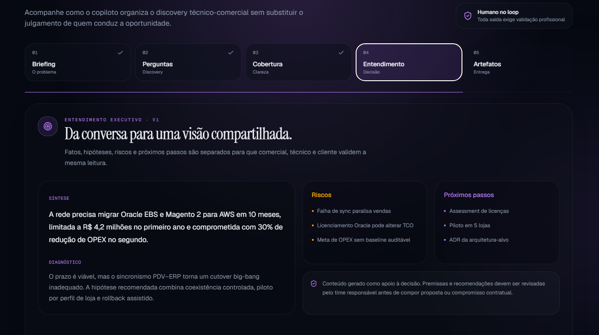
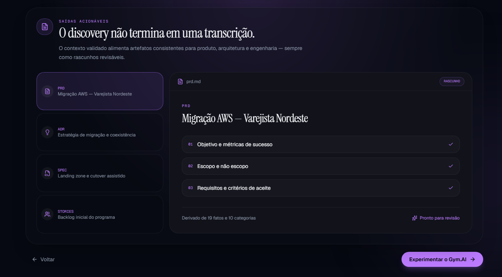

# Gym.AI — Discovery Copilot

[](https://github.com/ViniciusRyannS/gym-ai-discovery-copilot/actions/workflows/ci.yml)

Copiloto de discovery técnico-comercial para pré-vendas. O Gym.AI ajuda a
transformar briefings incompletos em uma descoberta estruturada por dez
categorias, com visualização de cobertura, Entendimento Executivo e artefatos
de apoio à decisão.

> O Gym.AI apoia o trabalho de profissionais de pré-vendas. Suas saídas não
> substituem validação técnica, comercial, jurídica ou de segurança.

## Demonstração

A rota pública `/demo` apresenta, sem login e sem dependências externas, a
jornada completa:

[▶ Abrir demonstração pública](https://viniciusryanns-gym-ai-discovery-copilot.east-gigantspinosaurus.workers.dev/demo)

1. briefing incompleto;
2. perguntas contextualizadas;
3. evolução da cobertura;
4. Entendimento Executivo;
5. previews de PRD, ADR, Spec e User Stories.

## Jornada em imagens

### 1. Do briefing incompleto à descoberta estruturada



### 2. Perguntas adaptativas e fatos rastreáveis



### 3. Entendimento Executivo para alinhar a decisão



### 4. Artefatos acionáveis e revisáveis



O projeto também possui um modo local para apresentação. Na tela `/auth`,
selecione **Demonstração** e use:

```text
E-mail: teste@email.com
Senha:  teste123456
```

As credenciais e os dados desse modo são fictícios e ficam somente no navegador.
Nenhuma informação do modo local é enviada ao Supabase ou a serviços de IA.

## Funcionalidades

- discovery técnico-comercial em dez categorias;
- radar de cobertura;
- portfólio de serviços;
- histórico de conversas;
- Entendimento Executivo versionado no ambiente conectado;
- geração de PRD, ADR, Spec e User Stories no ambiente conectado;
- Prompt Studio versionado;
- jornadas demonstrativas;
- rota pública guiada;
- modo local com login, portfólio, discoveries e chat determinístico;
- endpoint MCP protegido por OAuth.

## Estado atual

Este repositório apresenta um MVP funcional demonstrável, estabilizado para
portfólio. O ambiente conectado ainda não deve ser tratado como produto pronto
para produção.

### Disponível no modo local

- login e cadastro fictícios;
- portfólio inicial e edição local;
- criação de discovery;
- chat determinístico;
- cobertura progressiva;
- Entendimento Executivo local versionado;
- PRD, ADR, Spec e User Stories locais em Markdown;
- persistência no navegador;
- rota pública `/demo`.

### Dependente do ambiente Lovable/Supabase para funcionamento real com IA

- autenticação online;
- chamadas reais ao Lovable AI Gateway;
- Entendimento Executivo gerado por modelo;
- geração de artefatos por modelo;
- Prompt Studio;
- MCP e RLS.

### Limitações conhecidas

- não há colaboração multiusuário;
- anexos aceitam apenas `.txt` e `.md`;
- não há exportação nativa para PDF ou DOCX;
- cobertura é uma estimativa, não uma métrica auditada;
- não há suíte end-to-end;
- o fluxo de IA remoto ainda precisa de guardrails para mensagens vagas ou sem
  significado;
- o fluxo remoto atual usa uma chamada estruturada ao modelo; uma arquitetura
  com agentes independentes permanece apenas como possibilidade futura.

## Execução local

### Pré-requisitos

- Node.js 22 ou versão compatível;
- npm.

### Instalação

```bash
npm install
```

### Desenvolvimento

```bash
npm run dev
```

Abra o endereço informado pelo Vite e acesse:

```text
/demo
/auth
```

### Verificações

```bash
npm run typecheck
npm test
npm run build
```

O lint global passa sem erros e sem avisos.

## Variáveis de ambiente

Copie `.env.example` para `.env` somente ao trabalhar com o ambiente conectado:

```bash
cp .env.example .env
```

Nunca versione `.env`, chaves do Supabase ou segredos do gateway de IA.

O modo local e a rota `/demo` não exigem essas credenciais.

## Arquitetura

```text
src/routes/                    rotas e páginas
src/components/                componentes de interface
src/lib/*.functions.ts         funções executadas no servidor
src/lib/demo-mode/             autenticação e dados locais de demonstração
src/integrations/supabase/     clientes e middleware de autenticação
src/lib/mcp/                   servidor e ferramentas MCP
supabase/migrations/           schema e políticas RLS
docs/                          contexto, decisões, specs e sessões
```

Stack principal: TanStack Start, React 19, TypeScript, Tailwind CSS v4,
Supabase, Lovable AI Gateway, Gemini, Zod e TanStack Query.

## Autoria e origem

O projeto foi desenvolvido no contexto do Programa Pulse Mais, a partir de um
desafio proposto pela Clear IT. Essa origem não representa endosso institucional
da versão posterior mantida neste repositório.

O MVP acadêmico foi desenvolvido pelo grupo Gym.IA:

- Vinicius Ryann;
- Carlos Andrade;
- Eduarda Coelho;
- Fábio;
- Kaiky Gomes.

O produto foi reconstruído no Lovable a partir das especificações produzidas
pelo grupo. Esta cópia foi preservada para continuidade do projeto, e a etapa
de estabilização, testes, documentação e preparação para portfólio é conduzida
por Vinicius Ryann.

Esse histórico não atribui autoria exclusiva do MVP a uma única pessoa.
Detalhes adicionais estão em [docs/project-origin.md](docs/project-origin.md).

## Documentação

- [Mapa da documentação](docs/README.md)
- [Manual do sistema](docs/manual-do-sistema.md)
- [Contexto completo para ChatGPT e outras IAs](docs/contexto-completo-para-ia.md)
- [Guia para mentores e pessoas não técnicas](docs/guia-do-projeto-para-mentores.md)
- [Contexto do produto](docs/product-context.md)
- [Contexto técnico](docs/technical-context.md)
- [Plano de engenharia](docs/engineering-plan.md)
- [Quadro de tarefas](docs/task-board.md)
- [Estratégia de testes](docs/testing.md)
- [Roteiro de demonstração](docs/demo-script.md)
- [Especificações](docs/specs)
- [Decisões](docs/decisions)
- [Sessões de trabalho](docs/sessions)

## Licença

Nenhuma licença de código aberto foi definida. Até que os integrantes decidam
uma política de distribuição, todos os direitos permanecem reservados aos seus
respectivos autores.
